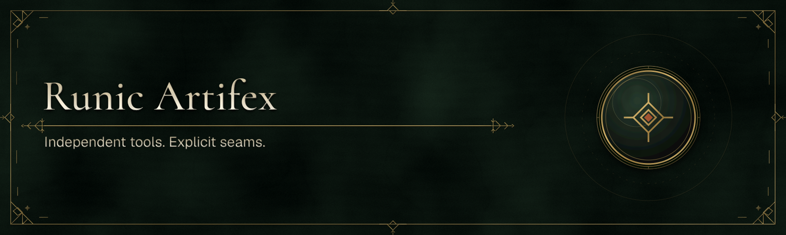

# Runic Artifex organization foundation

This repository owns the shared governance, organization profile, and release
contracts for the Runic Artifex organization. It is made public before the
product repositories so community health files and shared release validation
resolve for public contributors.

Each Runic SDK product maintains its own release policy and package inventory:
[Runic SDK](https://github.com/Runic-Artifex/runic-sdk/blob/main/eng/release/README.md),
[Runic CLI SDK](https://github.com/Runic-Artifex/runic-cli-sdk/blob/main/eng/release/README.md),
and [Runic Translations SDK](https://github.com/Runic-Artifex/runic-translations-sdk/blob/main/eng/release/README.md).
The launch, compatibility-train and evidence tooling here is retained for
historical/independent repository work and does not gate product releases.

The automatic legacy release-authority workflow and weekly candidate-registry
report are retired. Their source tools/data remain available for historical
inspection; routine organization documentation edits do not rebuild the deleted
multi-repository train.

Responsibilities outside product release automation:

- default contribution, security, support, issue, and pull-request guidance;
- retained organization release records;
- reusable validation for public NuGet artifacts;
- workflow templates that keep registry publishing explicit and product-owned.
- historical CI graph, GitHub Packages candidate policy, and retention tools.

See [the release record](RELEASES.md), [first-preview launch runbook](LAUNCH.md)
and [CI architecture](CI.md) for the historical multi-repository process. Current
product work follows the owning repository's contributor and release guides.
